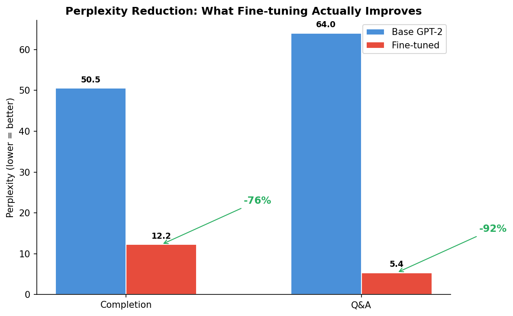
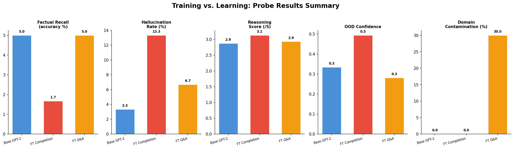
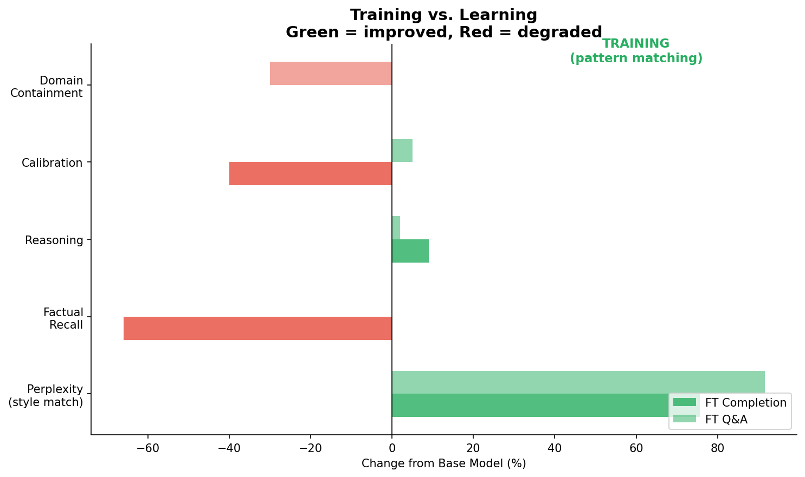

# Training vs. Learning: Does Fine-Tuning Teach Understanding?

**TL;DR**: Fine-tuning GPT-2 on podcast summaries dramatically improved style matching (75-92% perplexity reduction) but did not improve — and often degraded — factual recall, reasoning, calibration, and domain containment. The model learned to *sound like* podcast content without understanding it.

## Experiment Overview

We fine-tuned GPT-2 (124M parameters) on a corpus of 206 podcast episode summaries across 20 tech topics using LoRA (r=16, alpha=32), then ran three probes to test what the model actually learned.

| Component | Details |
|-----------|---------|
| Base model | GPT-2 (124M params) |
| Fine-tuning | LoRA on c_attn + c_proj (1.29% trainable params) |
| Dataset | 206 episodes, 20 topics, 10 podcasts |
| Formats | Completion (structured text) and Q&A (question-answer pairs) |
| Training | 3 epochs, batch_size=8, lr=2e-4 |

## What Fine-Tuning Improved

### Perplexity (Style Matching)

Fine-tuning achieved massive perplexity reductions on held-out podcast text:

| Format | Base PPL | Fine-tuned PPL | Reduction |
|--------|----------|----------------|-----------|
| Completion | 50.51 | 12.25 | **75.7%** |
| Q&A | 64.00 | 5.36 | **91.6%** |



The model became excellent at predicting the next token in podcast-style text. This is **training** — the model adapted its output distribution to match the training data.

### Domain Vocabulary

The fine-tuned completion model showed slightly better relevance scores on domain questions (0.33 vs 0.23), indicating it picked up topic-specific vocabulary.

## What Fine-Tuning Did NOT Improve

### 1. Factual Recall (Probe 1)

30 questions about facts directly present in the training data.

| Model | Accuracy | Hallucination Rate |
|-------|----------|-------------------|
| Base GPT-2 | 5.0% | 3.3% |
| FT Completion | **1.7%** | **13.3%** |
| FT Q&A | 5.0% | **6.7%** |

The completion model scored *worse* on accuracy while hallucinating **4x more often**. The model cannot retrieve specific facts from its training data — it just generates plausible-sounding but incorrect answers with higher confidence.

### 2. Reasoning (Probe 2)

30 questions requiring cross-domain synthesis and counterfactual reasoning.

| Model | Overall Score | Synthesis | Counterfactual |
|-------|--------------|-----------|----------------|
| Base GPT-2 | 2.87/5 | 2.95 | 2.70 |
| FT Completion | 3.13/5 | 3.25 | 2.90 |
| FT Q&A | 2.93/5 | 2.85 | 3.10 |

Improvements are negligible and fall within noise. All models produce generic, surface-level responses without genuine synthesis across topics. Fine-tuning on completions does not create the ability to reason about the domain.

### 3. Calibration (Probe 3)

15 questions about post-training events the model cannot possibly know.

| Model | Confidence on Unknowns | Assertive Rate |
|-------|----------------------|----------------|
| Base GPT-2 | 0.56 | 40% |
| FT Completion | **0.69** | **56%** |
| FT Q&A | 0.40 | 32% |

The completion model became **more confident on topics it can't know** — a classic loss of calibration. Fine-tuning didn't teach it what it doesn't know; it taught it to always sound authoritative.

### 4. Domain Containment (Probe 3)

10 questions about biology, sports, history, cooking, and other non-tech domains.

| Model | Contamination Rate | Avg Podcast Markers |
|-------|-------------------|-------------------|
| Base GPT-2 | 0% | 0.0 |
| FT Completion | 0% | 0.2 |
| FT Q&A | **30%** | **1.7** |

The Q&A model answered questions about Shakespeare's Hamlet and the Roman Empire using podcast framing: "key themes", "iterative approach", "measuring outcomes", "building systems". Fine-tuning overwrote the model's response distribution to route everything through a podcast-style template.

## The Evidence Table





## The Conclusion: Training ≠ Learning

| Capability | Achieved by Fine-Tuning? | What Happened |
|-----------|-------------------------|--------------|
| Style matching | Yes | 75-92% perplexity reduction |
| Domain vocabulary | Partially | Slight relevance improvement |
| Factual retrieval | **No** | Same or worse accuracy, 4x hallucination |
| Reasoning | **No** | Negligible improvement, within noise |
| Calibration | **No** | Lost calibration — more confident on unknowns |
| Domain containment | **No** | Podcast language bleeds into unrelated topics |

Fine-tuning taught the model to **pattern-match the statistical distribution of podcast text**. It did not teach the model to:
- Store or retrieve specific facts
- Reason about relationships between concepts
- Know what it doesn't know
- Keep domain knowledge contained

This is the fundamental distinction between **training** (adapting output distributions) and **learning** (acquiring retrievable, generalizable knowledge).

## Implications: When to Use What

| Goal | Approach | Why |
|------|----------|-----|
| Sound like domain X | Fine-tuning | Excellent at style transfer |
| Answer factual questions about domain X | RAG | Retrieval provides grounded facts |
| Reason about domain X | Large model + prompting | Reasoning requires scale, not fine-tuning |
| General + domain knowledge | RAG + base model | Avoids calibration loss and contamination |
| Cheapest domain adaptation | Fine-tuning small model | Good if you only need style, not knowledge |

**The bottom line**: If you ask "Does my fine-tuned model *understand* podcasts?", the answer is no. It *sounds like* it understands podcasts. That distinction matters for every production deployment decision.

## Reproducing These Results

```bash
# Setup
python -m venv .venv && source .venv/bin/activate
pip install -e ".[dev]"

# Generate data
python data/generate_corpus.py
python data/build_datasets.py

# Fine-tune (both formats)
python finetune.py --format completion
python finetune.py --format qa

# Run probes
python probes/factual_recall.py
python probes/reasoning.py
python probes/out_of_distribution.py

# Generate visualizations
pip install matplotlib
python visualize.py
```
